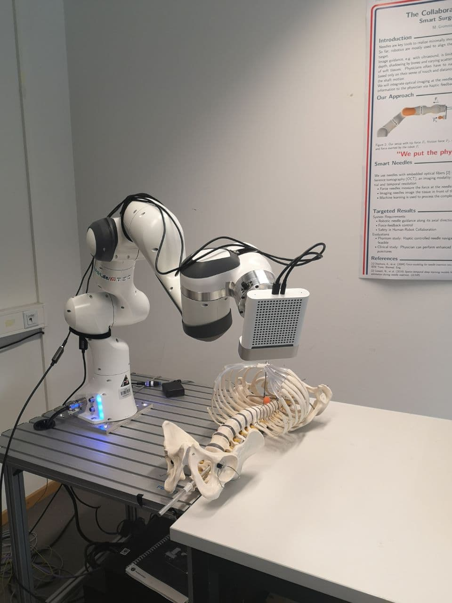
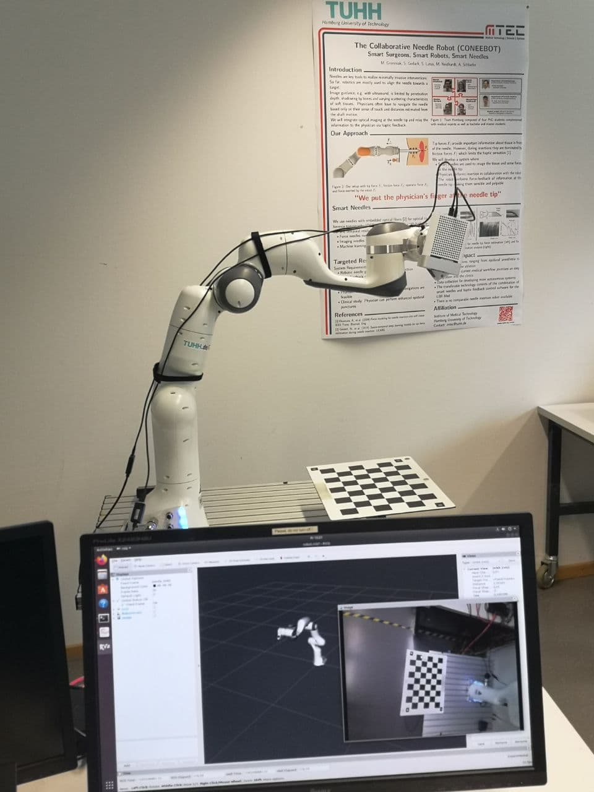
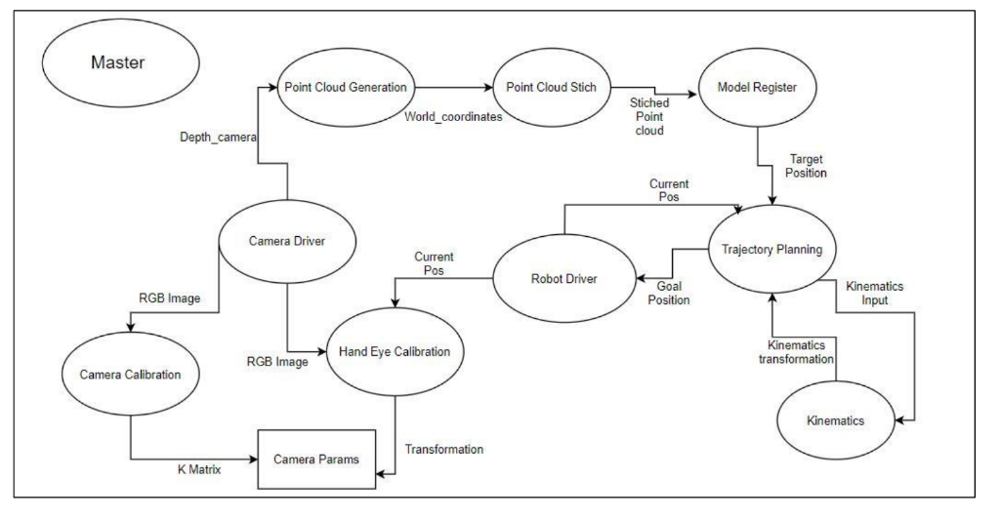

# Robotics and Navigation in Medicine

### Group Project: Image Guided Robotic Needle Placement

In this project, we developed an image guided robotic needle placement system using the
Robot Operating System (ROS) framework. You used a depth camera (Kinect Azure by
Microsoft) mounted on a robot arm (Panda by Franka Emika) to record 3D images of a chest
phantom. 
We had to find the transformation between the robot’s endeffector and the camera with 
an eye-in-hand calibration. Using this transformation we're required to be able to stich the
individual images to a combined scan while the robot drives the camera around the phantom.
We had then register this scan to a high resolution model, obtained from computer tomography.
Within the high resolution model a target for the needle will be given. We were required to perform
trajectory planning to find a collision free and kinematically feasible path to the target. Lastly,
exchange the camera for a needle (mock-up) and let the robot perform the insertion.

   

### [Project Description](https://github.com/adamanov/TUHH_RNM_Project/blob/master/documentation/ProjectDescription2020_update080520.pdf)
### [Project Plan](https://github.com/adamanov/TUHH_RNM_Project/blob/master/documentation/RNM_ProjectPlan_Group2updated.pdf)
### [Project Report](https://github.com/adamanov/TUHH_RNM_Project/blob/master/documentation/RNM_Report_Group_2.pdf)

### Tasks: 

#### Task 1: [Robot kinematics](https://github.com/adamanov/TUHH_RNM_Project/tree/master/src)

In the final application you will need to move the robot 

- for recoding of poses for the hand-eye calibration
- for scanning the chest phantom from different sides
- for the needle insertion

#### Task 2: [Trajectory planning](https://github.com/adamanov/TUHH_RNM_Project/tree/master/src)
In order to move the robot to a desired target it needed to send the robot a continous trajectory
of joint positions.

#### Task 3: [Camera calibration](https://github.com/adamanov/TUHH_RNM_Project/tree/master/src/camera_calibration)
The Kinect Azure has an RGB and a depth camera. The calibration of the Kinect had to be 
done so that it captures the true geometries of the world.

#### Task 4: [Eye-in-hand calibration](https://github.com/adamanov/TUHH_RNM_Project/tree/master/src/camera_calibration)
In order to stich the pointclouds of the chest phantom, it is needed to know the transformation
between the mounted camera (”eye”) and the robot’s end effector (”hand”)

#### Task 5: [Model recording and registration](https://github.com/adamanov/TUHH_RNM_Project/tree/master/src/point_cloud_generator/src)
In order to obtain a 3D Scan of the chest phantom, the camera has to be driven around the phantom.
Based on given a 3D CAD model of phantom, the model registration had to be done. 

### ROS Node Structure

[main git of project](https://github.com/johnmockler/rnm_group_2)

### References
#### Camera Calibration & Hand-Eye Calibration
- [Tutorials: OpenCV Camera Calibration](https://www.youtube.com/playlist?list=PLAp0ZhYvW6XbEveYeefGSuLhaPlFML9gP)
- [Non-orthogonal tool/flange and robot/worldcalibration](https://www.rob.uni-luebeck.de/publikationen_downloads/ermm_12.pdf-b46951f770e1e17036ee6b18fe686a1b.pdf)

#### PointCloud Registration and Pose Estimation
- [3D Object Recognition based on Correspondence Grouping](https://pcl.readthedocs.io/en/latest/correspondence_grouping.html#correspondence-grouping)
- [Hypothesis Verification for 3D Object Recognition](https://pcl.readthedocs.io/en/latest/global_hypothesis_verification.html#global-hypothesis-verification)
- [Tutorials: 3D-Object-Registration and Tracking](https://robotica.unileon.es/index.php/PhD-3D-Object-Tracking)

#### Additional
- [Real-Time Plane Segmentationusing RGB-D Camera](https://www.willowgarage.com/sites/default/files/holz_rgbd_seg.pdf)
